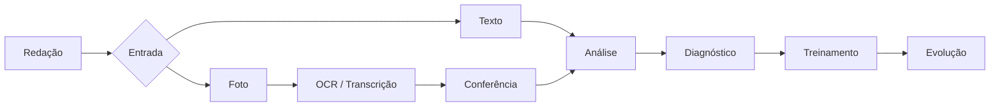

# Redaê

> Plataforma inteligente de treinamento e evolução para redação do ENEM.

O Redaê está sendo construído como um projeto público de software, faculdade e portfólio profissional.

## Sobre o projeto

O Redaê é uma plataforma de treinamento personalizado para estudantes que se preparam para a redação do ENEM.

O objetivo não é mostrar apenas quanto o estudante tirou. É ajudar a entender onde ele está errando, por que está errando e o que pode fazer para melhorar de forma prática.

## Problema

Estudantes praticam redação, mas muitas vezes:

- não sabem exatamente onde estão perdendo pontos;
- recebem feedback que não se transforma em ações práticas;
- têm dificuldade para acompanhar a própria evolução.

## Solução

O fluxo conceitual do Redaê é:

**Escrever → Analisar → Diagnosticar → Treinar → Evoluir**

Uma redação poderá ser enviada de duas formas:

1. **Texto**;
2. **Imagem**, tirada pela câmera ou selecionada da galeria.

Para imagens, o fluxo previsto é:

**Imagem → OCR/Transcrição → Conferência → Análise → Diagnóstico**

A conferência da transcrição acontece antes da análise, permitindo que o estudante confirme o conteúdo reconhecido.

## MVP

O MVP está sendo construído por fatias verticais. O estado atual é:

| Funcionalidade | Status |
|---|---|
| Cadastro, login e sessão | Implementado |
| Entrada por texto | Implementado |
| Persistência da redação e histórico | Implementado |
| Análise C1–C5 e nota estimada | Implementado |
| Diagnóstico separado da avaliação completa | Em evolução |
| Créditos e avaliação completa | Em desenvolvimento |
| Foto, OCR e conferência da transcrição | Planejado |

Chat livre, gamificação, comunidade e ranking não fazem parte do MVP inicial.

## Como funciona



## Stack

### Frontend

- React;
- TypeScript;
- Vite;
- Tailwind CSS.

### Backend

- Java 21;
- Spring Boot;
- Maven;
- Spring Web;
- Spring Data JPA e Hibernate;
- Spring Security;
- JWT;
- Bean Validation;
- PostgreSQL Driver;
- OpenAPI/Swagger.

### Infraestrutura e ferramentas

- Docker e Docker Compose para desenvolvimento;
- GitHub Actions para CI;
- Vercel planejado para o frontend;
- Render planejado para o backend.

Resend está reservado para uma etapa futura de confirmação de e-mail, recuperação de senha e comunicações relacionadas à conta. Azure poderá ser explorado posteriormente para aprendizado e evolução da infraestrutura.

## Estrutura do projeto

```text
.
├── frontend/              # Aplicação React e landing page pública
│   ├── public/             # Recursos públicos
│   ├── private/            # Espaço reservado para áreas autenticadas
│   └── src/                # Código da aplicação
├── backend/                # Aplicação Spring Boot mínima
├── agents/                 # Regras e instruções para agentes de IA
├── docs/                   # Documentação e decisões arquiteturais
├── .github/workflows/      # Workflows de CI
├── Dockerfile              # Imagem do frontend
└── docker-compose.yml      # Ambiente local combinado
```

O backend possui controllers, services, repositories, entities, DTOs e endpoints de autenticação, perfil e avaliação. O projeto usa um monólito modular em Spring Boot; microservices não fazem parte do MVP.

## Como executar localmente

### Frontend

Requisitos: Node.js e npm.

```bash
cd frontend
npm install
npm run dev
```

Para gerar o build de produção:

```bash
npm run build
```

### Backend

Requisitos para execução local: Java 21. O Maven pode ser baixado automaticamente pelo Maven Wrapper.

```bash
cd backend
./mvnw spring-boot:run
```

No Windows:

```powershell
cd backend
.\mvnw.cmd spring-boot:run
```

Testes e build:

```bash
./mvnw test
./mvnw package
```

O backend usa PostgreSQL e Flyway. As configurações devem ser fornecidas pelo ambiente local ou pela ferramenta de deploy; o repositório não contém arquivos de exemplo, senhas ou secrets. Nunca use secrets reais no repositório.

### Docker Compose

O ambiente completo de desenvolvimento — PostgreSQL, backend e frontend — pode ser iniciado com um único comando:

```bash
docker compose up --build
```

Depois que os containers iniciarem, acesse:

- Frontend: http://localhost:5173
- Backend: http://localhost:8080
- Swagger: http://localhost:8080/swagger-ui.html

Para encerrar e remover os containers e a rede do ambiente:

```bash
docker compose down
```

Os dados do PostgreSQL ficam no volume Docker `redae_postgres_data` e permanecem entre execuções. Para apagar também os dados locais, execute `docker compose down -v`.

O Compose usa credenciais fixas e isoladas exclusivamente para o banco local. Elas não devem ser reutilizadas em produção. Secrets de produção continuam sendo fornecidos somente pela plataforma de deploy ou pelo GitHub Actions.

## Status atual

O projeto possui:

- landing page e área autenticada em React;
- cadastro, login, refresh, logout e proteção por JWT;
- persistência PostgreSQL com migrations Flyway;
- envio de redação digitada e consulta do histórico;
- avaliação automática por IA nas competências C1–C5;
- nota calculada pelo backend e feedback persistido;
- separação de diagnóstico e avaliação completa em evolução;
- Docker Compose, CI e documentação consolidada.

Entrada por imagem/OCR, compra de créditos em produção e refinamentos da avaliação completa continuam no roadmap.

## Roadmap

1. Validar e detalhar o escopo do MVP.
2. Evoluir a experiência pública e definir a base das áreas autenticadas.
3. Implementar a entrada e o fluxo de redações conforme as decisões do MVP.
4. Implementar análise, diagnóstico e acompanhamento da evolução.
5. Avaliar integrações externas e evolução da infraestrutura conforme necessidades reais.

O roadmap não representa funcionalidades já disponíveis e poderá ser ajustado conforme as decisões do projeto.

## Documentação complementar

- [Documentação do projeto](docs/README.md)
- [Visão do produto](docs/produto.md)
- [Arquitetura](docs/arquitetura.md)
- [Decisões do projeto](docs/decisoes.md)
- [Regras oficiais para agentes](agents/PROJECT_RULES.md)

## Contribuição

O projeto está em fase inicial. Antes de propor alterações, consulte o [`agents/PROJECT_RULES.md`](agents/PROJECT_RULES.md), a documentação em `docs/` e o estado atual do código.

Toda contribuição deve ser pequena, justificada, testada quando aplicável e limitada ao escopo da tarefa.

## Licença

Uma licença open source ainda não foi definida para o repositório. Até que isso seja formalizado, não presuma permissões de redistribuição ou uso comercial além das aplicáveis ao projeto.
