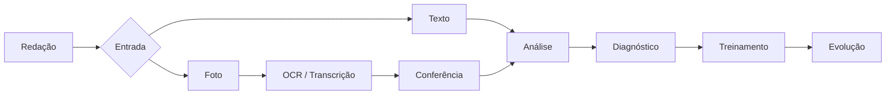

# Redaê

> Plataforma inteligente de treinamento e evolução para redação do ENEM.

O Redaê está sendo construído como um projeto público de software, faculdade e portfólio profissional.

## Sobre o projeto

O Redaê é uma plataforma de treinamento personalizado para estudantes que se preparam para a redação do ENEM.

O objetivo não é mostrar apenas quanto o estudante tirou. É ajudar a entender onde ele está errando, por que está errando e o que pode fazer para melhorar de forma prática.

## Problema

Estudantes praticam redação, mas muitas vezes:

- não sabem exatamente onde estão perdendo pontos;
- recebem feedback que não se transforma em ações práticas;
- têm dificuldade para acompanhar a própria evolução.

## Solução

O fluxo conceitual do Redaê é:

**Escrever → Analisar → Diagnosticar → Treinar → Evoluir**

Uma redação poderá ser enviada de duas formas:

1. **Texto**;
2. **Imagem**, tirada pela câmera ou selecionada da galeria.

Para imagens, o fluxo previsto é:

**Imagem → OCR/Transcrição → Conferência → Análise → Diagnóstico**

A conferência da transcrição acontece antes da análise, permitindo que o estudante confirme o conteúdo reconhecido.

## MVP

O escopo inicial ainda está em validação e as funcionalidades abaixo são planejadas, não implementadas:

| Funcionalidade | Status |
|---|---|
| Entrada por texto | Planejado |
| Foto pela câmera | Planejado |
| Foto da galeria | Planejado |
| OCR/Transcrição | Planejado |
| Conferência da transcrição | Planejado |
| Análise da redação | Planejado |
| Diagnóstico | Planejado |
| Histórico de evolução | A validar |

Chat livre, gamificação, comunidade e ranking não fazem parte do MVP inicial.

## Como funciona



## Stack

### Frontend

- React;
- TypeScript;
- Vite;
- Tailwind CSS.

### Backend

- Java 21;
- Spring Boot;
- Maven;
- Spring Web;
- Spring Data JPA e Hibernate;
- Spring Security;
- JWT;
- Bean Validation;
- Oracle Database Driver;
- OpenAPI/Swagger.

### Infraestrutura e ferramentas

- Docker e Docker Compose para desenvolvimento;
- GitHub Actions para CI;
- Vercel planejado para o frontend;
- Render planejado para o backend.

Resend está reservado para uma etapa futura de confirmação de e-mail, recuperação de senha e comunicações relacionadas à conta. Azure poderá ser explorado posteriormente para aprendizado e evolução da infraestrutura.

## Estrutura do projeto

```text
.
├── frontend/              # Aplicação React e landing page pública
│   ├── public/             # Recursos públicos
│   ├── private/            # Espaço reservado para áreas autenticadas
│   └── src/                # Código da aplicação
├── backend/                # Aplicação Spring Boot mínima
├── agents/                 # Regras e instruções para agentes de IA
├── docs/                   # Documentação e decisões arquiteturais
├── .github/workflows/      # Workflows de CI
├── Dockerfile              # Imagem do frontend
└── docker-compose.yml      # Ambiente local combinado
```

O backend ainda não possui controllers, services, repositories, entities, DTOs ou endpoints de negócio. O projeto começa como um monólito modular em Spring Boot; microservices não fazem parte do MVP.

## Como executar localmente

### Frontend

Requisitos: Node.js e npm.

```bash
cd frontend
npm install
npm run dev
```

Para gerar o build de produção:

```bash
npm run build
```

### Backend

Requisitos: Java 21 e Maven.

```bash
cd backend
mvn spring-boot:run
```

Testes e build:

```bash
mvn test
mvn package
```

Nesta etapa, o backend inicia sem credenciais externas e sem conexão obrigatória com banco. A configuração de exemplo para Oracle, JWT e Resend está em [`backend/src/main/resources/application-example.yml`](backend/src/main/resources/application-example.yml). Nunca use secrets reais no repositório.

### Docker Compose

Para executar as imagens de desenvolvimento definidas pelo projeto:

```bash
docker compose up --build
```

## Status atual

O projeto está na etapa de fundação técnica. Atualmente possui:

- landing page pública inicial;
- base React, TypeScript, Vite e Tailwind CSS;
- aplicação Spring Boot mínima;
- dependências preparadas para persistência, segurança, JWT, Oracle e OpenAPI;
- configuração inicial de Docker e CI;
- documentação e regras para agentes de IA.

Ainda não existem autenticação funcional, persistência, OCR, análise de redação, diagnóstico ou outras funcionalidades de negócio.

## Roadmap

1. Validar e detalhar o escopo do MVP.
2. Evoluir a experiência pública e definir a base das áreas autenticadas.
3. Implementar a entrada e o fluxo de redações conforme as decisões do MVP.
4. Implementar análise, diagnóstico e acompanhamento da evolução.
5. Avaliar integrações externas e evolução da infraestrutura conforme necessidades reais.

O roadmap não representa funcionalidades já disponíveis e poderá ser ajustado conforme as decisões do projeto.

## Documentação complementar

- [Documentação do projeto](docs/README.md)
- [Visão e stack](docs/project/overview.md)
- [Estrutura do repositório](docs/architecture/repository.md)
- [Decisão sobre monólito modular](docs/decisions/0001-monolito-modular.md)
- [Regras oficiais para agentes](agents/PROJECT_RULES.md)

## Contribuição

O projeto está em fase inicial. Antes de propor alterações, consulte o [`agents/PROJECT_RULES.md`](agents/PROJECT_RULES.md), a documentação em `docs/` e o estado atual do código.

Toda contribuição deve ser pequena, justificada, testada quando aplicável e limitada ao escopo da tarefa.

## Licença

Uma licença open source ainda não foi definida para o repositório. Até que isso seja formalizado, não presuma permissões de redistribuição ou uso comercial além das aplicáveis ao projeto.
