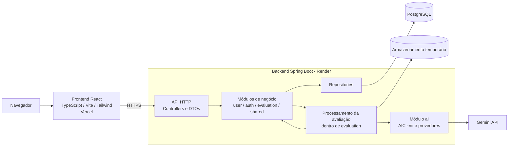

# Containers do sistema

O Redaê será implantado como frontend separado e backend monolítico modular. O processamento assíncrono permanece dentro do backend no MVP.

## Responsabilidades

- **Frontend:** experiência, validações de interface, editor, polling e apresentação dos estados.
- **API HTTP:** autenticação da requisição, validação de entrada, mapeamento de respostas e erros públicos.
- **Módulos de negócio:** casos de uso e regras do domínio de cada contexto.
- **Processamento da avaliação:** execução, retentativa, limite de concorrência e atualização de estados da avaliação, mantidos no módulo `evaluation`.
- **Módulo `ai`:** abstração do provedor e adaptadores dos modelos utilizados.
- **Repositories:** persistência acessada somente pelo próprio módulo responsável.
- **PostgreSQL:** fonte oficial dos dados persistentes.
- **Armazenamento temporário:** imagens durante o OCR e conferência, com exclusão automática.
