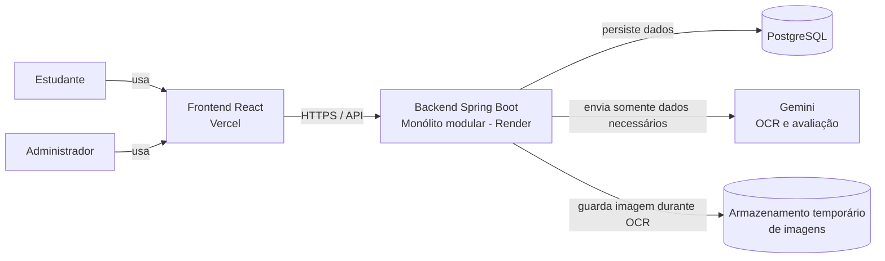

# Contexto do sistema

Este diagrama apresenta os atores, o Redaê e os sistemas externos do MVP. Usuários não acessam diretamente banco de dados, provedor de IA ou armazenamento temporário.

## Limites

- O frontend cuida da experiência, formulários, editor, estados de processamento e exibição de resultados.
- O backend cuida de autenticação, autorização, regras de negócio, persistência, filas, limites e integrações.
- O PostgreSQL é a fonte oficial dos dados persistidos do produto.
- O Gemini recebe somente o necessário para transcrição ou avaliação; dados pessoais não são enviados.
- O armazenamento de imagens é temporário e deve excluir a imagem após a confirmação da transcrição, respeitando o prazo máximo definido.
