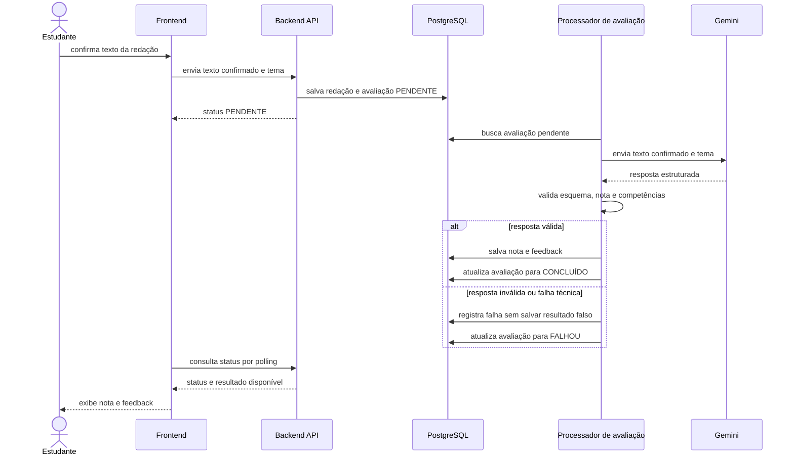

# Fluxo de avaliação por IA

A avaliação começa somente depois que o estudante confirma o texto. O backend valida a resposta do Gemini antes de persistir qualquer nota ou feedback.

## Regras

- a IA recebe somente o texto confirmado e o tema necessário;
- a resposta precisa obedecer ao contrato estruturado definido pelo backend;
- nota fora da escala ou competência ausente invalida a resposta;
- resposta inválida não gera nota visível nem avaliação concluída;
- retentativas só ocorrem para falhas técnicas, respeitando o limite de uma avaliação válida por redação;
- o resultado persistido contém a nota, os feedbacks, a versão da avaliação e a data de geração.
