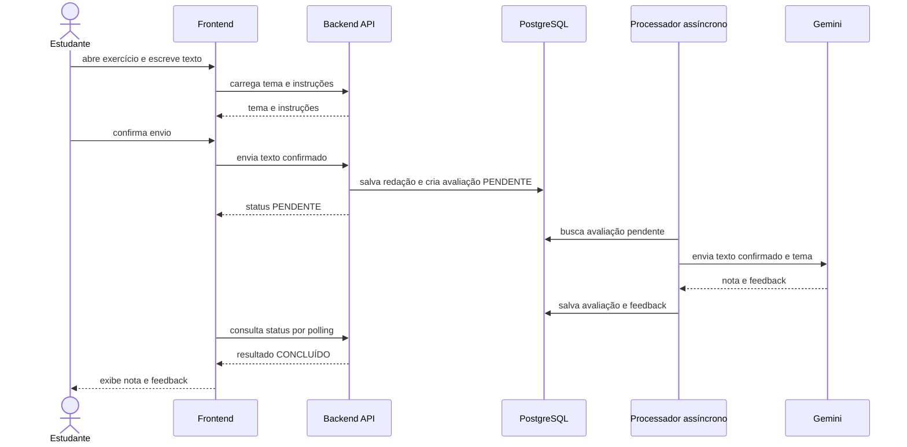

# Fluxo de redação digitada

No MVP, o estudante não salva manualmente um rascunho. O texto permanece no editor enquanto a sessão estiver ativa e só passa a ser persistido quando o estudante confirma o envio.

Se o estudante abandonar o editor antes da confirmação, o texto não será recuperável pelo sistema no MVP. Essa decisão não impede que um recurso de rascunho automático seja avaliado posteriormente.
