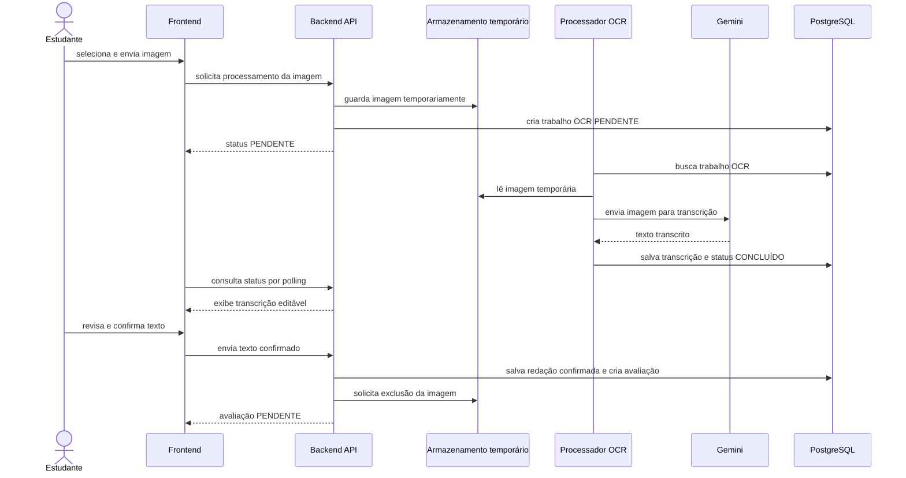

# Fluxo de redação por imagem

A imagem é um insumo temporário para transcrição. A avaliação nunca utiliza diretamente a imagem ou a transcrição não confirmada.

## Regras

- a imagem fica disponível somente durante OCR e conferência;
- a transcrição pode ser corrigida pelo estudante antes da confirmação;
- somente o texto confirmado é persistido como redação e enviado para avaliação;
- a imagem deve ser excluída após a confirmação, respeitando o prazo máximo de 10 minutos;
- se o OCR falhar, o trabalho fica `FALHOU` e nenhuma avaliação é criada;
- se o estudante abandonar a conferência sem confirmar, a imagem e a transcrição temporária são descartadas conforme a política de retenção.
