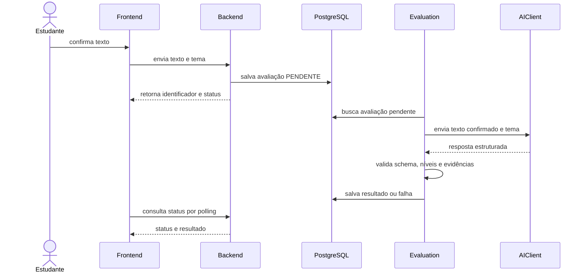

# Arquitetura

## Visão geral

O Redaê é um monólito modular Spring Boot, consumido por um frontend React, TypeScript, Vite e Tailwind CSS. O PostgreSQL é a fonte oficial dos dados persistentes. O processamento da avaliação acontece no backend e o frontend acompanha estados por polling.

```text
backend/src/main/java/br/com/redae/
├── user/       # identidade, usuários, perfis e papéis
├── auth/       # autenticação, sessões e autorização
├── evaluation/ # redação, processamento, notas e feedback
├── ai/         # contrato AIClient e adaptadores de provedores
├── gateway/    # pagamentos, webhooks e créditos
└── shared/     # componentes transversais
```

Cada módulo usa camadas internas quando necessárias: `controller`, `service`, `repository`, `dto`, `entity` e `config`.

## Responsabilidades

- **Frontend:** experiência, formulários, editor, polling e apresentação dos estados.
- **Auth:** login, cadastro, cookies, sessões, JWT e autorização.
- **User:** entidade do usuário, perfil e papéis.
- **Evaluation:** ciclo de vida da redação, regras de diagnóstico, processamento, nota e feedback.
- **AI:** abstração `AIClient` e clientes específicos de provedores, como Gemini. A avaliação depende da interface, não do provedor.
- **Gateway:** integração com provedores de pagamento, recebimento de webhooks, compras e transações de créditos. O módulo será organizado em `controller`, `service`, `client`, `dto`, `entity` e `repository`.
- **Shared:** erros públicos, trace ID, respostas comuns e componentes transversais.
- **PostgreSQL:** usuários, redações confirmadas, avaliações, resultados, créditos e compras.

## Fluxo de texto



## Entrada por imagem

Imagens são temporárias. O backend recebe o upload, inicia a transcrição, permite que o estudante revise o texto e só cria a avaliação persistente depois da confirmação. A imagem é excluída após a confirmação ou expiração definida.

## IA e processamento

O módulo `evaluation` chama `AIClient`. O módulo `ai/client` contém o contrato e os adaptadores. O cliente padrão é o OpenAI GPT-4o Mini, e o Gemini permanece disponível por configuração; `AI_PROVIDER` define qual implementação é registrada.

A resposta da IA é validada antes da persistência. Nota fora da escala, competência ausente, feedback inválido ou evidência não encontrada impedem a conclusão. Falhas técnicas podem ser retentadas; resposta inválida não produz nota falsa.

## Persistência

Entidades principais: `User`, `Evaluation`, `CompetencyScore`, `FeedbackItem` e
`PaymentTransaction`. As entidades de oferta, preço e ledger de créditos serão
adicionadas ao módulo `gateway` conforme as regras de compra e consumo forem
implementadas.

- uma avaliação pertence a um usuário;
- uma avaliação possui notas C1–C5;
- cada nota pode possuir feedbacks;
- o texto confirmado é persistido com a avaliação;
- o saldo é derivado das transações de crédito;
- migrations Flyway são versionadas e não devem ser editadas depois de aplicadas.

## Segurança e privacidade

- JWT e refresh token protegido em cookie;
- autorização por usuário proprietário ou administrador;
- senhas armazenadas somente como hash;
- frontend não acessa banco, armazenamento ou provedor de IA diretamente;
- logs não devem conter redação, transcrição, feedback completo ou secrets;
- respostas de erro não expõem stack trace;
- toda resposta relevante possui `traceId`.

## Infraestrutura

Frontend e backend são serviços separados. PostgreSQL roda no Compose local. O backend pode ser hospedado no Render e o frontend na Vercel. Secrets são fornecidos pelo ambiente e nunca versionados.
